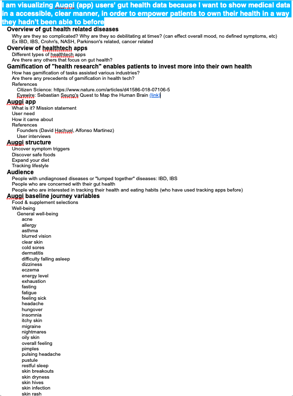
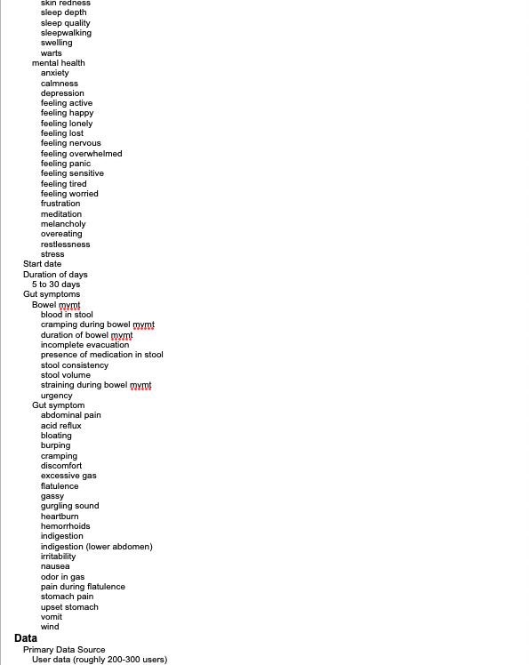
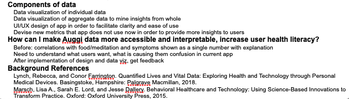
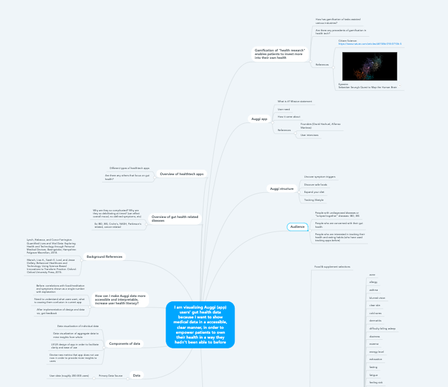
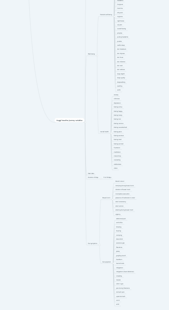
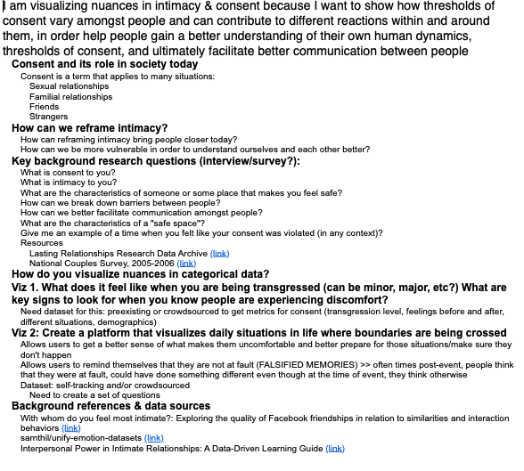
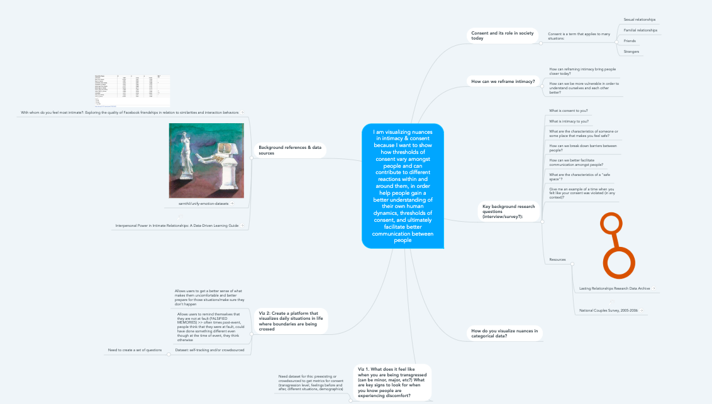
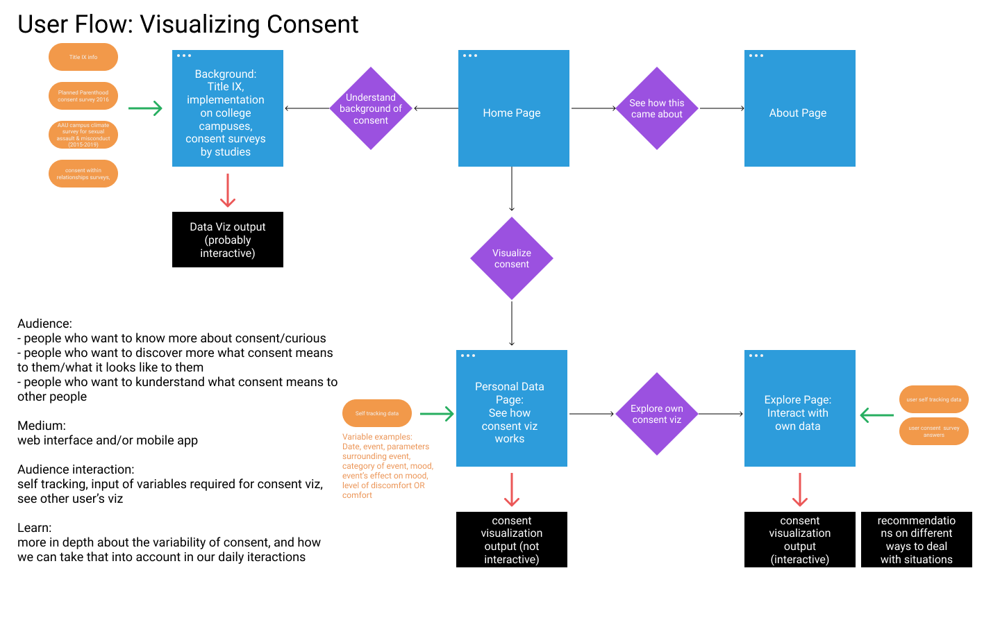

### Exploratory References

1. Lynch, Rebecca, and Conor Farrington. Quantified Lives and Vital Data: Exploring Health and Technology through Personal Medical Devices. Basingstoke, Hampshire: Palgrave Macmillan, 2018.

2. Marsch, Lisa A., Sarah E. Lord, and Jesse Dallery. Behavioral Healthcare and Technology: Using Science-Based Innovations to Transform Practice. Oxford: Oxford University Press, 2015.

3. Marshall, George. Dont Even Think about It: Why Our Brains Are Wired to Ignore Climate Change. London: Bloomsbury, 2015.

4. Schneider, Birgit, and Thomas Nocke. Image Politics of Climate Change: Visualizations, Imaginations, Documentations. Bielefeld: Transcript, 2014.

---

### Mindmap Outlines of Lead Topics

#### Auggi - gamification of gut health tracking

Outline of Auggi topic:

Mindmap snaps:

Link to mindmap: https://mm.tt/1409927696?t=LZcLwtP7wT

#### Visualizing Consent

Outline of Consent topic:

Mindmap snaps:

Link to mindmap: https://mm.tt/1409972566?t=LFTc9mK4Zi

---

### User flow of final topic: visualizing consent

**Audience:** 
- people who want to know more about consent/curious
- people who want to discover more what consent means to them/what it looks like to them
- people who want to kunderstand what consent means to other people

**Medium:** 
- web interface and/or mobile app

**Audience interaction:** 
- self tracking, input of variables required for consent viz, see other user’s viz

**Learn:** 
- more in depth about the variability of consent, and how we can take that into account in our daily iteractions

